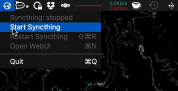

**DEPRECATED**: I recommend to use the official [Syncthing for macOS](https://github.com/syncthing/syncthing-macos) wrapper application, which comes along with a nice and even more advanced status bar. 

# Syncthing BrewBar

**Syncthing BrewBar** <strike>is</strike> was a macOS status bar application for brew syncthing installations.

Just like my predecessor ([syncthing-bar](https://github.com/m0ppers/syncthing-bar)) i missed some nice syncthing statusbar tool to easily start and stop out beloved syncing tool, so i just wrote my own.

## Signatures & Notarization

Times are hard, macOS Catalina required to notarize macOS application. Since shell commands are used to start and stop syncthing, the application cannot be sandboxed and thus can't be notarized. 

## What is this?

This tool is supposed to control an existing brew syncthing installation. It's really just the UI element, the daemon is still controlled by brew and the configuration in the hands of syncthing itself.

The app uses the *brew services* control commands to start and stop syncthing and parses the syncthing configuration file for easy WebUI and folder access. 



## Installation

Prefered way via brew cask: 

```brew cask install jonashoechst/hoechst/syncthing-brewbar```

... or download latest release from the [Github releases page](https://github.com/jonashoechst/Syncthing-BrewBar/releases) and drag & drop to /Applications/


### Features:

- display **status**
- **start** / **stop** / **restart** the syncthing service
- open the **WebUI** in the default browser
- **open** syncthing'd folders **in Finder**

## Requirements

- [brew](https://brew.sh) (who doesn't use brew anyhow?)
- a brew syncthing installation: ```brew install syncthing```

## Caveats / not implemented yet
Note: pull requests are very welcome!

- error handling, e.g.:
	- syncthing isn't installed
	- alternative config paths; currently hardcoded to `~/Library/Application\ Support/Syncthing/config.xml`
- code refactoring
- tests
